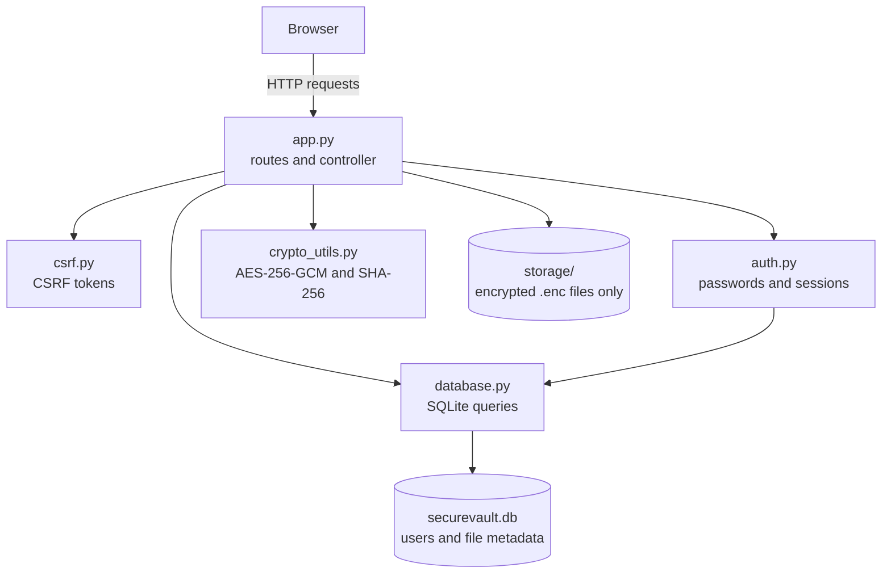
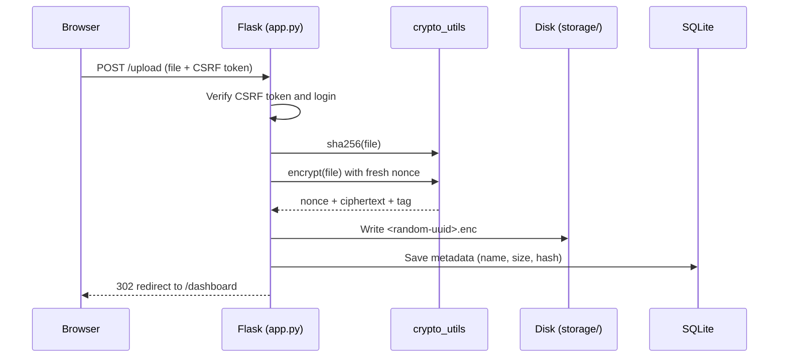
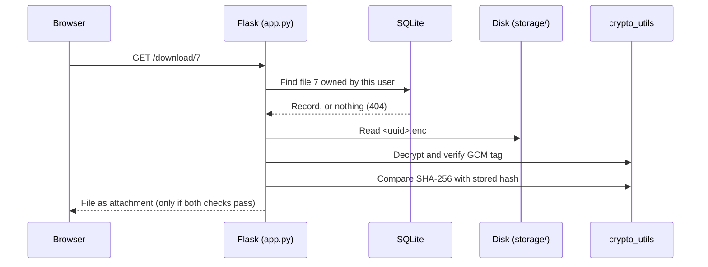
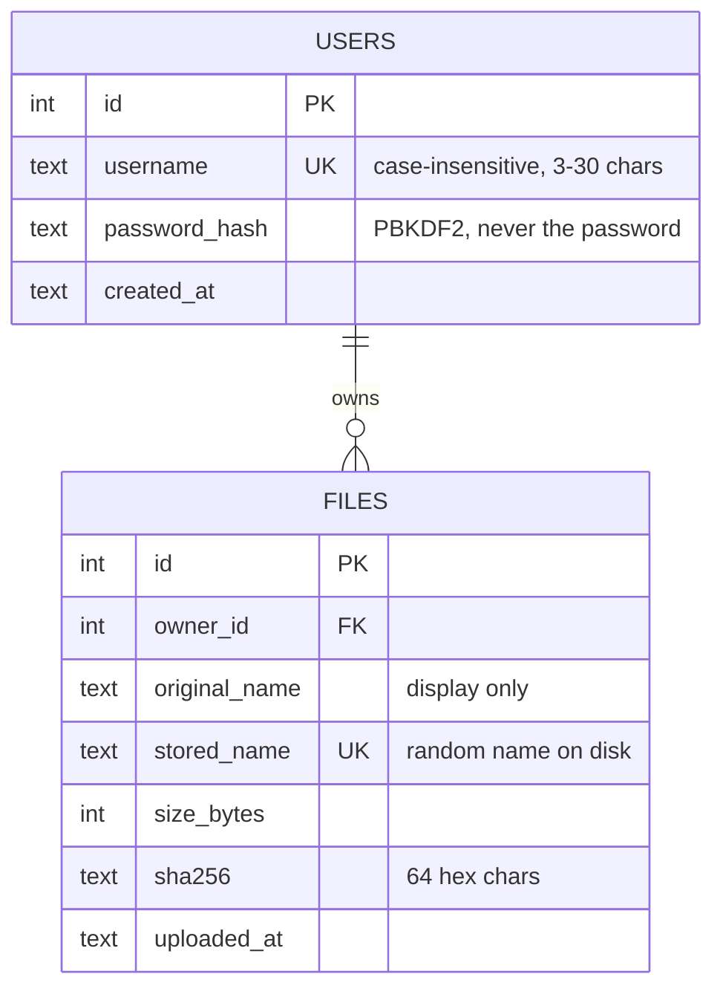

# 🔒 SecureVault

**A Secure Cloud File Storage System Using AES-256-GCM Encryption and SHA-256 Integrity Verification**

SecureVault is a web application where users can register, log in, and store files securely. Every file is **encrypted before it touches the disk**, every download is **checked for tampering**, and passwords are **never stored**, only salted, slow hashes of them.

It was built as a Cryptography and Network Security (CNS) course project, with a focus on applying core security concepts correctly while keeping the codebase small and readable.

> If someone steals the server's storage folder, all they get is random-looking bytes with random file names.

---

## Table of Contents

- [Features](#features)
- [Security Design](#security-design)
- [Tech Stack](#tech-stack)
- [Architecture](#architecture)
- [Project Structure](#project-structure)
- [Getting Started](#getting-started)
- [Configuration](#configuration)
- [Usage](#usage)
- [Routes](#routes)
- [Testing and Demos](#testing-and-demos)
- [Screenshots](#screenshots)
- [Troubleshooting](#troubleshooting)
- [Limitations and Future Work](#limitations-and-future-work)
- [Contributing](#contributing)
- [License](#license)
- [Author](#author)
- [Acknowledgements](#acknowledgements)

---

## Features

- **User accounts:** register, log in, and log out with secure sessions.
- **Encrypted uploads:** files are encrypted with AES-256-GCM before being saved.
- **Verified downloads:** each file is decrypted and integrity-checked twice before it is sent back.
- **File dashboard:** see each file's name, size, upload time, and SHA-256 fingerprint.
- **Independent verification:** compare the dashboard hash with `certutil` or `sha256sum` on your downloaded copy.
- **Delete files:** removes both the database record and the encrypted data.
- **Responsive and accessible UI:** works on phones, supports keyboards and screen readers.

---

## Security Design

| Goal                 | How SecureVault achieves it                                                                                              |
| -------------------- | ------------------------------------------------------------------------------------------------------------------------ |
| **Confidentiality**  | AES-256-GCM encryption of every file at rest, with a fresh random 96-bit nonce per file                                  |
| **Integrity**        | GCM authentication tag (detects any modified bit) plus a SHA-256 hash of the original file (detects swapped files)       |
| **Authentication**   | Passwords hashed with PBKDF2-HMAC-SHA256, 600,000 iterations, unique random salt per user                                |
| **Authorization**    | Every file query filters by owner, so other users' files return 404 (prevents IDOR)                                      |
| **Session security** | HMAC-signed cookies with `HttpOnly` and `SameSite=Lax`; session cleared on login (prevents session fixation)             |
| **CSRF protection**  | Random per-session token checked on every POST, compared in constant time                                                |
| **SQL injection**    | All queries are parameterized (`?` placeholders)                                                                         |
| **XSS**              | Jinja auto-escaping, a strict Content-Security-Policy, and downloads forced to `application/octet-stream` as attachments |
| **Path traversal**   | Files stored under random UUID names; user-supplied names are never used on disk                                         |
| **User enumeration** | Same error message and the same response time for "no such user" and "wrong password"                                    |
| **Clickjacking**     | `X-Frame-Options: DENY` and CSP `frame-ancestors 'none'`                                                                 |
| **DoS via uploads**  | Upload size limit (10 MB by default)                                                                                     |
| **Key management**   | Secrets loaded from environment variables, never hard-coded or committed                                                 |

### Encrypted file format

```
┌──────────────┬────────────────────────────────┬──────────────┐
│ Nonce        │ Ciphertext                     │ Auth Tag     │
│ 12 bytes     │ same length as original file   │ 16 bytes     │
└──────────────┴────────────────────────────────┴──────────────┘
```

Every stored file is exactly 28 bytes larger than the original.

---

## Tech Stack

| Layer            | Technology                             | Why                                                        |
| ---------------- | -------------------------------------- | ---------------------------------------------------------- |
| Language         | Python 3.13                            | Readable, with strong standard-library support             |
| Web framework    | Flask 3                                | Lightweight, minimal boilerplate                           |
| Cryptography     | `cryptography` (AESGCM)                | Audited, industry-standard library; no hand-written crypto |
| Password hashing | Werkzeug (PBKDF2)                      | Ships with Flask; NIST-approved algorithm                  |
| Database         | SQLite                                 | Built into Python; zero setup                              |
| Templates        | Jinja2                                 | Auto-escaping protects against XSS                         |
| Frontend         | HTML, CSS, a little vanilla JavaScript | No build tools; CSP-friendly                               |
| Config           | `python-dotenv`                        | Keeps secrets out of the code                              |
| Testing          | pytest                                 | Standard Python test runner                                |

---

## Architecture



Each layer only talks to the layer below it. Routes never write SQL or call AES directly, so every security-critical operation lives in exactly one place.

### Upload flow



### Download flow



### Database schema



The schema is in Third Normal Form (3NF).

---

## Project Structure

```
secure-cloud-storage/
├── app.py              # Flask app factory, routes, security headers, error handling
├── auth.py             # Validation, PBKDF2 password hashing, sessions, login_required
├── crypto_utils.py     # AES-256-GCM encryption/decryption and SHA-256 hashing
├── csrf.py             # CSRF token generation and verification
├── database.py         # SQLite schema and parameterized queries
├── demo_crypto.py      # Live demo: encryption, tamper detection, wrong-key rejection
├── demo_database.py    # Live demo: constraints, IDOR protection, SQL injection
├── demo_auth.py        # Live demo: salted hashing, validation, constant-time login
├── templates/
│   ├── base.html       # Shared layout: navbar, flash messages, footer
│   ├── login.html
│   ├── register.html
│   ├── dashboard.html  # Upload form and file table
│   └── error.html
├── static/
│   ├── style.css       # All styling (no inline styles, for CSP)
│   ├── app.js          # Delete confirmation (external file, for CSP)
│   └── favicon.svg
├── tests/              # Automated tests (pytest)
├── requirements.txt
├── .gitignore
└── README.md
```

These are created at runtime and are **never committed**:

```
├── .env                # Your secret keys
├── securevault.db      # SQLite database
└── storage/            # Encrypted files
```

---

## Getting Started

### Prerequisites

- [Anaconda](https://www.anaconda.com/download) (or any Python 3.10+ install)
- [Git](https://git-scm.com/downloads)
- A modern browser
- Optional: [VS Code](https://code.visualstudio.com/) with the Python extension

### Installation

The commands below are for **Anaconda Prompt** on Windows. On macOS or Linux, use `cd` without `/d`, and the rest is the same.

**1. Clone the repository**

```bash
git clone https://github.com/YOUR_USERNAME/secure-cloud-storage.git
cd /d secure-cloud-storage
```

**2. Create and activate an environment**

```bash
conda create -n securevault python=3.13 -y
conda activate securevault
```

**3. Install dependencies**

```bash
pip install -r requirements.txt
```

**4. Generate two secret keys** (run the command twice and keep both outputs)

```bash
python -c "import secrets; print(secrets.token_hex(32))"
```

**5. Create a `.env` file** in the project root:

```env
FLASK_SECRET_KEY=paste_first_key_here
FILE_ENCRYPTION_KEY=paste_second_key_here
```

> ⚠️ **Never commit `.env`.** It is already listed in `.gitignore`.
> ⚠️ **Back up `FILE_ENCRYPTION_KEY`.** If it is lost, every stored file becomes permanently unreadable. That is how encryption is supposed to work.

**6. Run the app**

```bash
python app.py
```

**7. Open your browser** at **http://127.0.0.1:5000**

The database and `storage/` folder are created automatically on first run.

---

## Configuration

All settings come from environment variables (or the `.env` file).

| Variable                | Required | Default                             | Description                                                          |
| ----------------------- | -------- | ----------------------------------- | -------------------------------------------------------------------- |
| `FLASK_SECRET_KEY`      | ✅ Yes   | none                                | Signs session cookies. At least 32 characters; use 64 hex characters |
| `FILE_ENCRYPTION_KEY`   | ✅ Yes   | none                                | AES-256 key: exactly 64 hex characters (32 bytes)                    |
| `DATABASE_PATH`         | No       | `securevault.db` (next to `app.py`) | Location of the SQLite database                                      |
| `STORAGE_FOLDER`        | No       | `storage/` (next to `app.py`)       | Where encrypted files are written                                    |
| `MAX_UPLOAD_MB`         | No       | `10`                                | Maximum upload size in megabytes                                     |
| `SESSION_COOKIE_SECURE` | No       | `false`                             | Set to `true` in production (HTTPS only)                             |
| `FLASK_DEBUG`           | No       | `false`                             | Development only. **Never enable in production**                     |

The two keys are deliberately separate (**key separation**): leaking the session key does not expose files, and leaking the file key does not allow forged logins.

The app refuses to start if either key is missing or the wrong length.

---

## Usage

1. **Sign up** with a username (3–30 letters, numbers, or underscores) and a password (8+ characters).
2. **Log in.**
3. **Upload** a file from the dashboard. It is encrypted before it is stored.
4. **Download** it at any time. It is decrypted and verified first.
5. **Verify** the download yourself: click the hash in the dashboard to reveal all 64 characters, then compare it with:

   ```bash
   # Windows
   certutil -hashfile "path\to\downloaded-file" SHA256

   # macOS / Linux
   shasum -a 256 path/to/downloaded-file
   ```

6. **Delete** files you no longer need.

---

## Routes

| Route            | Method    | Login | Description                                  |
| ---------------- | --------- | ----- | -------------------------------------------- |
| `/`              | GET       | No    | Redirects to the dashboard or the login page |
| `/register`      | GET, POST | No    | Sign-up form and account creation            |
| `/login`         | GET, POST | No    | Login form and authentication                |
| `/logout`        | POST      | No    | Ends the session                             |
| `/dashboard`     | GET       | Yes   | Lists the user's files and the upload form   |
| `/upload`        | POST      | Yes   | Hashes, encrypts, and stores a file          |
| `/download/<id>` | GET       | Yes   | Decrypts, verifies, and returns a file       |
| `/delete/<id>`   | POST      | Yes   | Deletes a file and its encrypted data        |

All POST requests require a valid CSRF token. Actions that change data are POST only, never GET.

| Status | Meaning in this app                                                                 |
| ------ | ----------------------------------------------------------------------------------- |
| 200    | Page loaded                                                                         |
| 302    | Redirect (after a form submission, or when not logged in)                           |
| 400    | Missing or invalid CSRF token                                                       |
| 404    | File does not exist **or belongs to someone else** (deliberately indistinguishable) |
| 405    | Wrong HTTP method                                                                   |
| 413    | Upload exceeds the size limit                                                       |
| 500    | Server error (details stay in the server log)                                       |

---

## Testing and Demos

### Demo scripts

Each script demonstrates one security layer and cleans up after itself:

```bash
python demo_crypto.py     # Random nonces, decryption, 1-bit tamper detection, wrong-key rejection
python demo_database.py   # Duplicate users, CHECK constraints, IDOR protection, SQL injection attempt
python demo_auth.py       # Salted hashes, validation, equal timing for all failed logins
```

### Automated tests

```bash
pytest -v
```

### Manual security checks

| Check              | How                                                                   | Expected result                                       |
| ------------------ | --------------------------------------------------------------------- | ----------------------------------------------------- |
| Encryption at rest | Open any file in `storage/`                                           | Random bytes, random file name                        |
| Tamper detection   | Flip one byte of a `.enc` file, then download it                      | "Integrity check failed", download blocked            |
| IDOR               | Log in as another user and open `/download/<someone else's id>`       | 404 Not Found                                         |
| CSRF               | Clear the hidden `csrf_token` value in DevTools, then submit the form | 400 Bad Request                                       |
| Access control     | Visit `/dashboard` while logged out                                   | Redirect to login                                     |
| Security headers   | DevTools → Network → response headers                                 | CSP, `X-Frame-Options`, `nosniff`, `no-store` present |

To simulate tampering from the project folder:

```bash
python -c "import pathlib; p = next(pathlib.Path('storage').glob('*.enc')); b = bytearray(p.read_bytes()); b[20] ^= 1; p.write_bytes(b); print('Tampered:', p.name)"
```

---

## Screenshots

> Add screenshots to a `docs/screenshots/` folder and update the paths below.

| Login                                     | Dashboard                                    |
| ----------------------------------------- | -------------------------------------------- |
|  |  |

| Encrypted storage                                        | Tamper detection                                       |
| -------------------------------------------------------- | ------------------------------------------------------ |
|  |  |

---

## Troubleshooting

| Problem                                                  | Fix                                                                                    |
| -------------------------------------------------------- | -------------------------------------------------------------------------------------- |
| `RuntimeError: FLASK_SECRET_KEY is missing or too short` | Create `.env` in the project root with both keys                                       |
| `ValueError: FILE_ENCRYPTION_KEY must be 32 bytes`       | The key must be exactly 64 hex characters; regenerate it                               |
| `ModuleNotFoundError: No module named 'flask'`           | Activate the environment: `conda activate securevault`                                 |
| `conda activate` does nothing in VS Code                 | Switch the VS Code terminal from PowerShell to Command Prompt                          |
| `cd D:\...` doesn't change folder                        | Use `cd /d D:\...` in Command Prompt                                                   |
| Every form returns 400                                   | The page is stale; refresh it to get a fresh CSRF token                                |
| Old files fail to download after changing keys           | Files can only be decrypted with the key that encrypted them; restore the original key |
| Upload over the limit shows "connection reset"           | Known behaviour of Flask's development server; the size limit is working               |
| `address already in use`                                 | The app is already running; stop it with Ctrl+C                                        |

---

## Limitations and Future Work

These are known trade-offs, kept out to keep the project beginner-friendly:

- **Single master key.** Upgrade to envelope encryption (a unique key per file, wrapped by a master key in a KMS).
- **No associated data (AAD).** Bind each ciphertext to its database record at the crypto level. (The SHA-256 check currently catches swapped files.)
- **Server-side encryption.** End-to-end encryption in the browser would hide files even from the server.
- **No rate limiting or account lockout.** Add Flask-Limiter to slow down password guessing.
- **No multi-factor authentication.** Add TOTP codes from an authenticator app.
- **PBKDF2 is not memory-hard.** Argon2id or scrypt resist GPU attacks better.
- **Whole files held in memory.** Use streaming, chunked encryption for large files.
- **SQLite and local storage.** Move to PostgreSQL and object storage (e.g. S3) to scale.
- **Database file not encrypted.** Usernames and file names are readable with disk access (contents and passwords are protected).
- **No pagination, progress bar, or dark mode** in the UI.

---

## Contributing

Contributions and suggestions are welcome.

1. Fork the repository.
2. Create a branch: `git checkout -b feature/your-feature`
3. Commit your changes: `git commit -m "Add your feature"`
4. Push the branch: `git push origin feature/your-feature`
5. Open a pull request.

Please keep these rules:

- All crypto stays in `crypto_utils.py` and all SQL stays in `database.py`.
- Every SQL query must be parameterized.
- No inline scripts or styles in templates (the CSP blocks them).
- Never commit `.env`, databases, or anything in `storage/`.

---

## License

This project is licensed under the MIT License. See the [LICENSE](LICENSE) file for details.

---

## Author

**Vivek Vardhan**
B.Tech Computer Science and Engineering, CMR Technical Campus
GitHub: [@vivekvardhan12](https://github.com/vivekvardhan12)

---

## Acknowledgements

- [`cryptography`](https://cryptography.io/) for the audited AES-GCM implementation
- [Flask](https://flask.palletsprojects.com/) and [Werkzeug](https://werkzeug.palletsprojects.com/)
- [OWASP](https://owasp.org/) cheat sheets on password storage, CSRF, and XSS prevention
- NIST SP 800-38D (GCM), SP 800-132 (PBKDF2), and SP 800-63B (digital identity guidelines)
